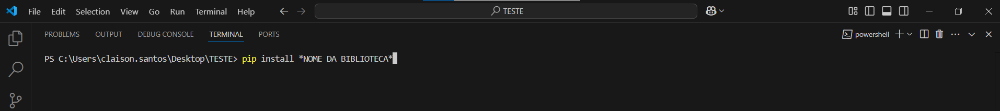
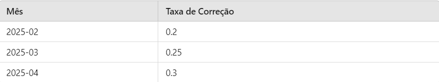

### Calculadora de Correção Monetária 💰  
- Este é um script em Python que calcula a correção de um valor inicial baseado em taxas de correção diárias extraídas de um arquivo Excel 📊.  
- O programa utiliza a biblioteca pandas para ler os dados e a datetime para lidar com datas 📅.  
- O cálculo é feito levando em consideração a quantidade de dias passados desde uma data de referência até o dia atual.

### Requisitos 📦

- Bibliotecas:  
- pandas  
- openpyxl (para leitura de arquivos .xlsx)  
### Instalação das dependências 🔧    

Para o programa funcionar corretamente, deve-se instalar as bibliotecas pandas e openpyxl.    

- pip install openpyxl  
- pip install pandas  

### Como usar 🚀
Você pode alterar e inserir meses do ano e suas taxas seguindo o padrão da planilha.  

### Interação com o programa 💬

- O script calculará a correção monetária diária do valor inicial (definido como R$ 360.000,00).  
- Consultará o arquivo Excel para buscar a taxa de correção do mês atual.  
- Apresentará o valor corrigido após o número de dias passados desde a data de referência (1º de fevereiro de 2025) 📅. OBS: Essa data está fixa, mas também pode ser fornecida pelo usuário.  
- Perguntará ao usuário se deseja continuar o cálculo com base em novas taxas de correção 🔄.  
- O programa continuará a execução até que o usuário opte por sair, respondendo "n" quando perguntado se deseja continuar. 🚪
